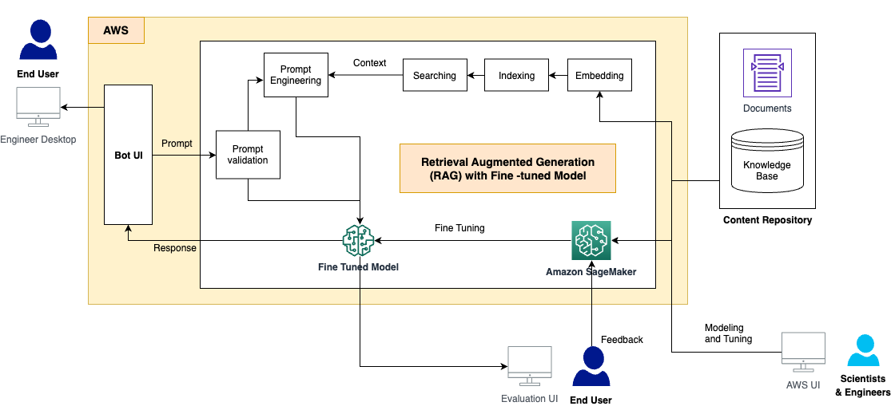
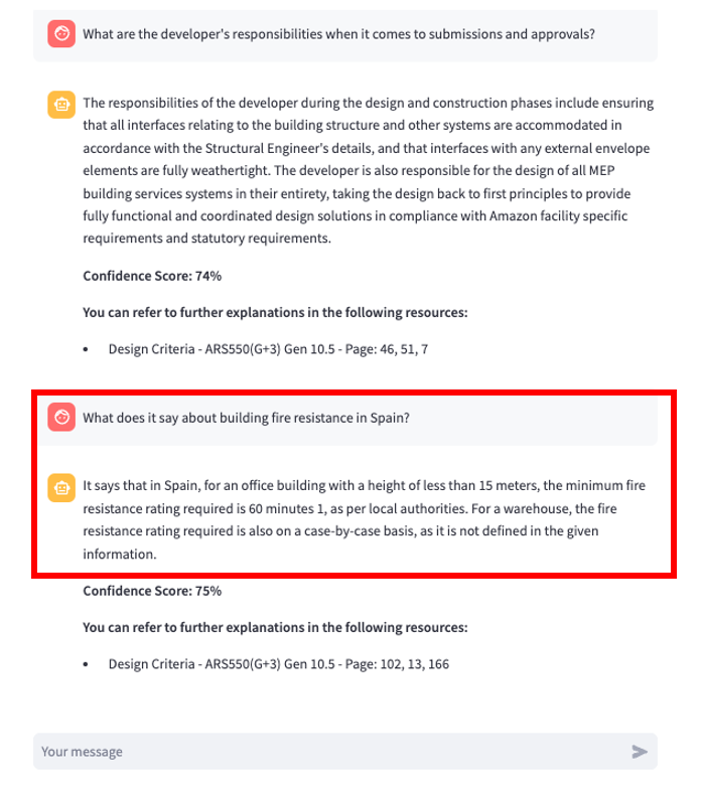
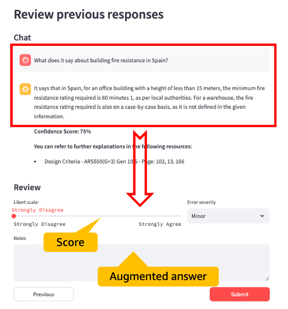
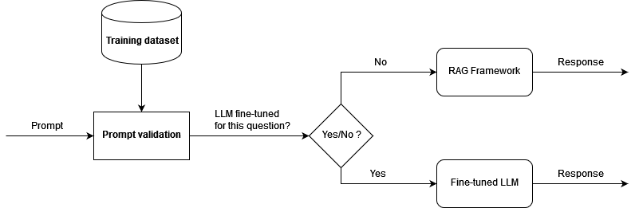

# A novel framework with RAG and fine-tuned LLM for question-answer task on Amazon SageMaker

This is the repo for AWS ML Blog Post: [A generative AI-powered solution on Amazon SageMaker to help Amazon EU Design and Construction](https://aws.amazon.com/blogs/machine-learning/a-generative-ai-powered-solution-on-amazon-sagemaker-to-help-amazon-eu-design-and-construction/)

### Introduction

[Retrieval Augmented Generation](https://docs.aws.amazon.com/sagemaker/latest/dg/jumpstart-foundation-models-customize-rag.html) (RAG) is a commonly used [generative AI](https://aws.amazon.com/generative-ai/) solution for question answering tasks. RAG searches documents through [large language model](https://aws.amazon.com/what-is/large-language-model/) (LLM) embedding and vectoring, creates the context from search results through clustering, and uses the context as an augmented prompt to inference a foundation model to get the answer.    

This method is less efficient for the highly technical documents, which contains significant unstructured data such as Excel sheets, tables, lists, figures, and images. In this case, the question answering task works better by fine-tuning the LLM with the documents. 

Fine-tuning adjusts and adapts the weights of the pre-trained LLM to improve the model quality and accuracy. The model will be trained using the documents for a question answering task, to learn the corresponding knowledge from the documents directly. Unlike RAG, it’s not dependent on whether the documents are properly embedded and indexed, and whether the semantic search algorithm is effective enough to return the most relevant contents from the vector database.

### Solution Architecture 

The solution architecture contains 3 components. 
1. Content repository: The document contents include a wide range of human-readable documents with various formats, such as PDF files, Excel sheets, wiki pages, and more, are stored in an Amazon Simple Storage Service (Amazon S3) bucket.   
2. RAG pipeline: This is implemented by LangChain and retrieves the relevant data from documents, augments the prompts by adding the retrieved data in context, the vector store is supported by an OpenSearch cluster. The retrieved contents are passes to a fine-tuned LLM to generate outputs. 
3. End-user UI: This is the chatbot UI to capture users’ questions, present the answer from the RAG and LLM response, and collect users' feedback on the bot responses.
   
### A question-answer bot powered by RAG pipeline 

In our implementation, the RAG pipeline is based on a [Streamlit](https://streamlit.io/) web application. Streamlit enabled us to develop the Q&A bot interface in a straightforward yet effective manner, providing a high quality user experience. Upon user’s question, the bot returns an answer to the question along with a confidence score, and reference links to the original documents. For more details please refer to this [python script](Streamlit/Assistant.py).  

In the Streamlit application, we use [LangChain](https://www.langchain.com/) to perform semantic search on Amazon OpenSearch serving as our vector store for embedded paragraphs to ensure reduced latency for document retrieval, and interfaces with the fine-tuned LLM hosted on AWS SageMaker. For more details please refer to this [python script](Streamlit/chain.py).  

One key feature of this framework is to enable the collection of users' feedback for future improvement. To achieve this, we developed a feedback collection module in the UI. This UI allows the users to mark the question’s severity level (minor, major), score the bot response (in 5 levels: strongly disagree, disagree, neutral, agree, strongly agree), and provide the correct answer or any other comment. DynamoDB tables are utilized to store session information and user feedbacks. For more details please refer to this [python script](Streamlit/Assistant - Feedback.py).  

        
### Supervised Fine-Tuning (SFT) on Mistral-7b-instruct 

Supervised Fine-Tuning is a common approach to adapt a pre-trained LLM on a labeled dataset. The model learns to predict the correct label for a specfic task, a question-answer task in this repo. We use the SFTTrainer class provided in the [TRL](https://github.com/huggingface/trl) library to facilitate the SFT process.  

To accelerate the training process and reduce the cost of compute resources, we employed [Parameter Efficient Fine-Tuning](https://arxiv.org/abs/2305.16742) (PEFT) with the [Low-Rank Adaptation](https://arxiv.org/abs/2106.09685) (LoRA) technique. PEFT allows us to only fine-tune a small number of extra model parameters, and LoRA represents the weight updates with two smaller matrices through low-rank decomposition. With PEFT and LoRA on [quantization](https://huggingface.co/docs/optimum/en/concept_guides/quantization), a compression operation that further reduces the memory footprint of the model and accelerates the training and inference performance, you can fit the training within smaller size of compute instance. Please refer to this [notebook](notebooks/Mistral7b_fine-tuning.ipynb) for the SFT process. 

You can deploy the fine-tuned model to SageMaker endpoint for future inference. Please refer to this [notebook](notebooks/DJL_deployment_mistral7bft.ipynb) for the deployment and inference processes. 

### Integrate the fine-tuned LLM in RAG pipeline 

To take advantage of both the RAG framework and the fine-tuned LLM, and also to reduce the hallucination, we first semantically validate the incoming question. If the question is among the training data for the fine-tuning (the fine-tuned model already has the knowledge to provide a high-quality answer), then we direct the question as a prompt to inference the fine-tuned model. Otherwise, the question goes through LangChain and gets the response from RAG. The following diagram illustrates this workflow.

Please refer to this [python script]() for the RAG pipeline with fine-tuned LLM. 

## Contribute
If you would like to contribute to the project, see [CONTRIBUTING](CONTRIBUTING.md) for more information.

## License
The code examples in this library are released under the MIT-0 License. See the [LICENSE](LICENSE-NOTEBOOKS) file for details.
